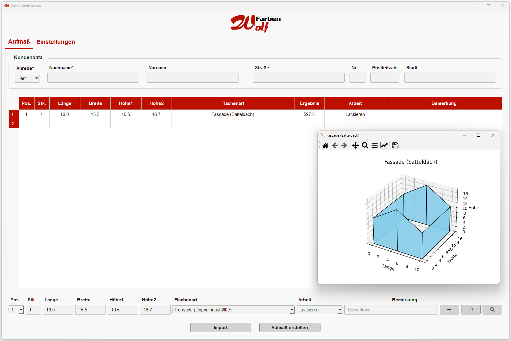
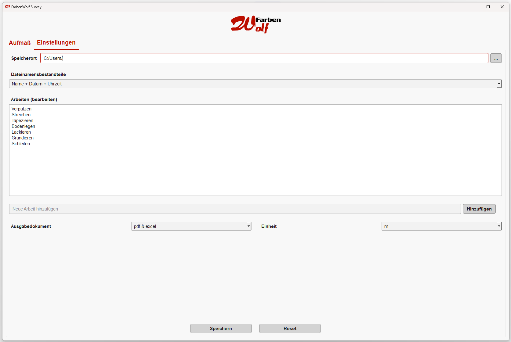

# Übersicht
**Farben Wolf** ist eine Python-basierte Desktop-App zur Flächenaufmaß-Erfassung für Maler- und Lackiererbetriebe.
Die Anwendung ermöglicht die eigenständige Flächenberechnung auf Grundlage eingegebener Maße sowie eine visuelle Darstellung zur Kontrolle und Plausibilitätsprüfung.

# Installation und Nutzung
Die App kann entweder von **Entwicklern** zur Erweiterung oder Personalisierung genutzt werden oder von **Benutzern**, die nur die fertige Anwendung installieren möchten.

## Kompatibilität
Für die **Entwicklung** wird lediglich **Python** benötigt. Das Projekt sollte unter **Windows**, **macOS** und **Linux** laufen.  
Für **Benutzer** steht derzeit **nur der Windows-Build** zur Verfügung.

| Verwendung      | Voraussetzung               |
|-----------------|-----------------------------|
| **Entwicklung** | Python 3.10 – Python 3.12   |
| **Benutzung**   | Windows 10 oder Windows 11  |


## Benutzerinstallation
### Download

🔗 **[FarbenWolf-Anwendung herunterladen](https://github.com/LuigiFerraioli/FarbenWolf/releases/latest/download/FarbenWolf.zip)**

Lade die ZIP-Datei herunter und entpacke sie. Danach kannst du die `FarbenWolf.exe` direkt ausführen.

## Anpassungen
### Logo anpassen

Um das Logo zu ändern, ersetze im Ordner `_internals/resources` die folgenden Dateien durch eigene Bilder **mit identischem Dateinamen**:

- `LogoIcon.ico`
- `LogoIcon.png`
- `LogoTransparent.png`


### Verknüpfung erstellen (Empfehlung)

Nach dem Herunterladen müssen die ausführbare Datei (`.exe`) und der Ordner `_internals` **im selben Verzeichnis** bleiben.

Es wird daher empfohlen, **eine Verknüpfung der .exe** auf den Desktop oder ins Startmenü zu legen, statt Dateien innerhalb des App-Verzeichnisses zu verschieben.


## Installation für Entwickler

### Variante 1: Installation mit install.bat (Windows)

1. Öffne die Eingabeaufforderung (CMD) im Projektverzeichnis.
2. Führe die Datei `install.bat` aus, indem du den Befehl eingibst:

Erstellt eine Anwendung und einen _internal-Ordner (schnellere Ausführung)
```bash
install.bat
```
3. Dies installiert automatisch alle benötigten Python-Pakete.

### Variante 2: Manuelle Installation

1. Stelle sicher, dass Python 3.10 oder höher installiert ist und `python` bzw. `py` im PATH verfügbar ist.
2. Installiere alle benötigten Abhängigkeiten mit pip:

```bash
pip install -r requirements.txt
```

Erstelle die ausführbare Datei mit PyInstaller und der vorhandenen `FarbenWolf.spec`:

```bash
python -m PyInstaller --clean FarbenWolf.spec
```

# Die Anwendung



Die Benutzeroberfläche ermöglicht eine intuitive Eingabe von Raummaßen und Flächentypen.  
Eine grafische Vorschau unterstützt die visuelle Kontrolle der eingegebenen Werte und der resultierenden Flächenaufteilung.

### Hauptfunktionen:

- Eingabe und Verwaltung von Kundendaten
  - Kundenadresse
  - Objektadresse
- Auswahl der ausgeführten Arbeit
- Automatische Flächenberechnung basierend auf der Auswahl der Flächenart  
- Möglichkeit zur visuelle Darstellung der Flächen zur Plausibilitätskontrolle  
- Export der Ergebnisse in Excel- und/oder PDF-Format  
- Re-Import bereits vorhandener Excel-Dateien zur weiteren Bearbeitung

### Einstellungen



In den Einstellungen können wichtige Voreinstellungen getroffen werden:

- Festlegung des Speicherorts für exportierte Dateien  
- Auswahl der Namensgebung beim Speichervorgang  
- Auswahl des Ausgabeformats (z. B. Excel, PDF)  
- Auswahl der Maßeinheit (z. B. Meter oder Zentimeter)
- Auswahl der automatischen Bereitstellung der PDF nach dem Speichervorgang (Ja/Nein)

Zusätzlich können Arbeiten beliebig hinzugefügt werden. Diese dienen – wie auch die Bemerkungen – als Unterstützung während der Dateneingabe und sind nicht verpflichtend.