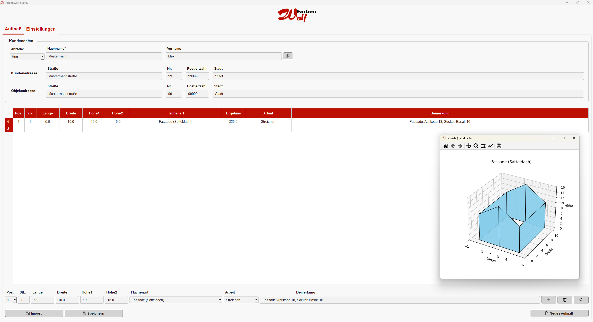
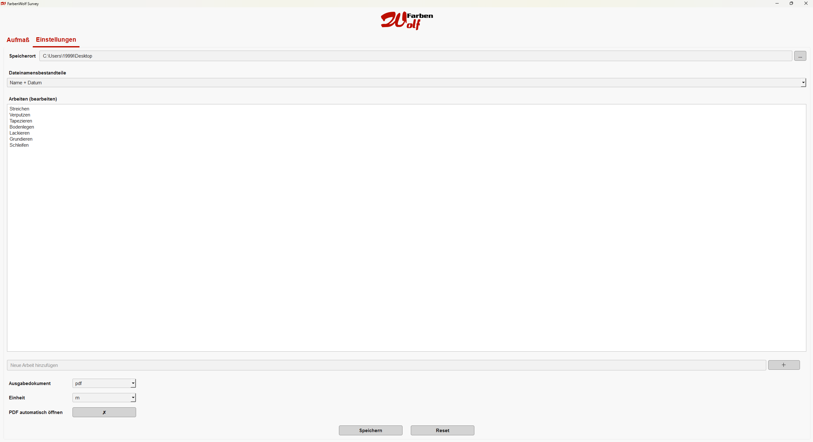

## Übersicht
**Farben Wolf** ist eine Python-basierte Desktop-App zur Flächenaufmaß-Erfassung für Maler- und Lackiererbetriebe.
Die Anwendung ermöglicht die eigenständige Flächenberechnung auf Grundlage eingegebener Maße sowie eine visuelle Darstellung zur Kontrolle und Plausibilitätsprüfung.

Das Programm läuft mit Python 3.10 oder höher und kann unter Windows installiert und als eigenständige ausführbare Datei genutzt werden.

---

## Voraussetzungen
- Python 3.10 oder höher
- Windows-Betriebssystem (für die EXE-Version)
- Internetverbindung zum Installieren der Abhängigkeiten (nur beim Setup)

---

## Installation und Nutzung

### Variante 1: Installation mit install.bat (Windows)

1. Öffne die Eingabeaufforderung (CMD) im Projektverzeichnis.
2. Führe die Datei `install.bat` aus, indem du den Befehl eingibst:

Erstellt eine Anwendung und einen _internal-Ordner (schnellere Ausführung)
```bash
install.bat
```
3. Dies installiert automatisch alle benötigten Python-Pakete.

### Variante 2: Manuelle Installation

1. Stelle sicher, dass Python 3.10 oder höher installiert ist und `python` bzw. `py` im PATH verfügbar ist.
2. Installiere alle benötigten Abhängigkeiten mit pip:

```bash
pip install -r requirements.txt
```

Erstelle die ausführbare Datei mit PyInstaller und der vorhandenen `main.spec`:

```bash
python -m PyInstaller --clean main.spec
```

<br>

#### Anpassen des Logos
Um das Logo zu ändern, ersetzen Sie die Dateien `LogoIcon.ico`, `LogoIcon.png` und `LogoTransparent.png` durch eigene Bilder mit identischem Dateinamen.


---

<br>

## Die Anwendung



Die Benutzeroberfläche ermöglicht eine intuitive Eingabe von Raummaßen und Flächentypen.  
Eine grafische Vorschau unterstützt die visuelle Kontrolle der eingegebenen Werte und der resultierenden Flächenaufteilung.

#### Hauptfunktionen:

- Eingabe und Verwaltung von Kundendaten
- Auswahl der ausgeführten Arbeit
- Automatische Flächenberechnung basierend auf der Auswahl der Flächenart  
- Möglichkeit zur visuelle Darstellung der Flächen zur Plausibilitätskontrolle  
- Export der Ergebnisse in Excel- und/oder PDF-Format  
- Re-Import bereits vorhandener Excel-Dateien zur weiteren Bearbeitung


### Einstellungen



In den Einstellungen können wichtige Voreinstellungen getroffen werden:

- Festlegung des Speicherorts für exportierte Dateien  
- Auswahl der Namensgebung beim Speichervorgang  
- Auswahl des Ausgabeformats (z. B. Excel, PDF)  
- Auswahl der Maßeinheit (z. B. Meter oder Zentimeter)
- Auswahl der automatischen Bereitstellung der PDF nach dem Speichervorgang (Ja/Nein)

Zusätzlich können Arbeiten beliebig hinzugefügt werden. Diese dienen – wie auch die Bemerkungen – als Unterstützung während der Dateneingabe und sind nicht verpflichtend.

